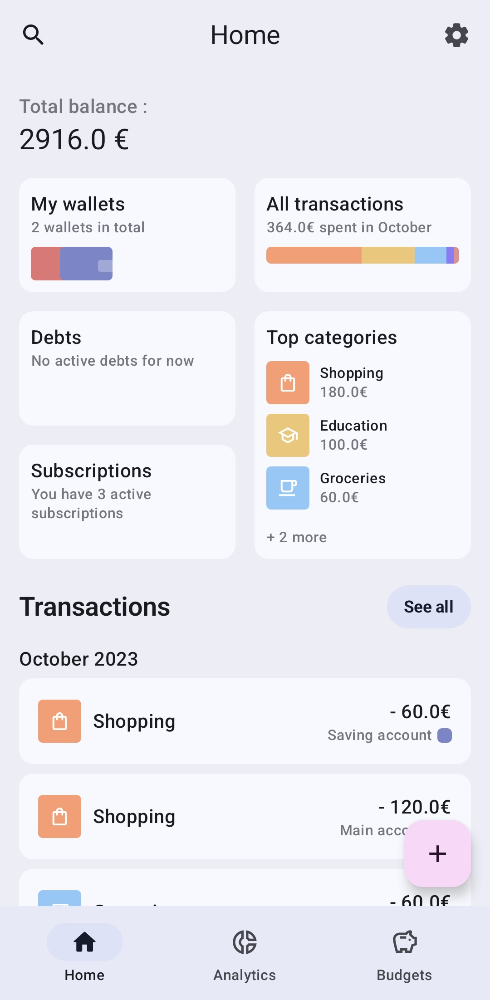
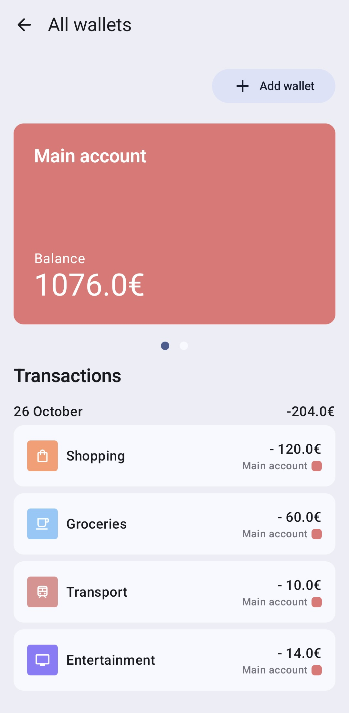

# Expense Tracker App 📊💸

## Overview

Welcome to the Expense Tracker App! This is your go-to application for managing your daily expenses with ease. Keep track of your spending and savings like never before. 🌟

 

> 🎨 UI inspired by the work of [Erkin Gadzhiev](https://www.behance.net/erkingadzh7324). Check out his [Wallie Budget Tracking App](https://www.behance.net/gallery/179094539/Wallie-Budget-Tracking-App?tracking_source=search_projects%7Cmaterial+design+app) project on Behance.

## Features 💡

- **Intuitive UI**: The app is built using Jetpack Compose, bringing a seamless and modern user interface.
- **Reactive Programming**: Utilizes Kotlin Flow for smooth data handling and UI updates.
- **Dependency Injection**: Hilt is used for efficient and clean dependency injection.
- **Local Storage**: Room is utilized for robust local database management.
- **Data Persistence**: Proto DataStore for key-value data storage.
- **Theming**: Supports both light and dark themes, with dynamic theming.
- **Material Design**: Fully implemented according to Material 3 guidelines.
- **Navigation**: Smooth navigation experience with animations.

## Tech Stack 🛠️

- Android
- Kotlin
- Jetpack Compose
- Kotlin Flow
- Hilt
- Room
- Proto DataStore
- Material 3

## Installation 📥

1. Clone this repository:
    ```
    git clone https://github.com/fontaipi/expense-tracker.git
    ```

2. Open the project in Android Studio.

3. Build and run the project on an emulator or actual device.

## Contributing 🤝

If you find any bugs or have a feature request, please open an issue. Contributions are more than welcome.
